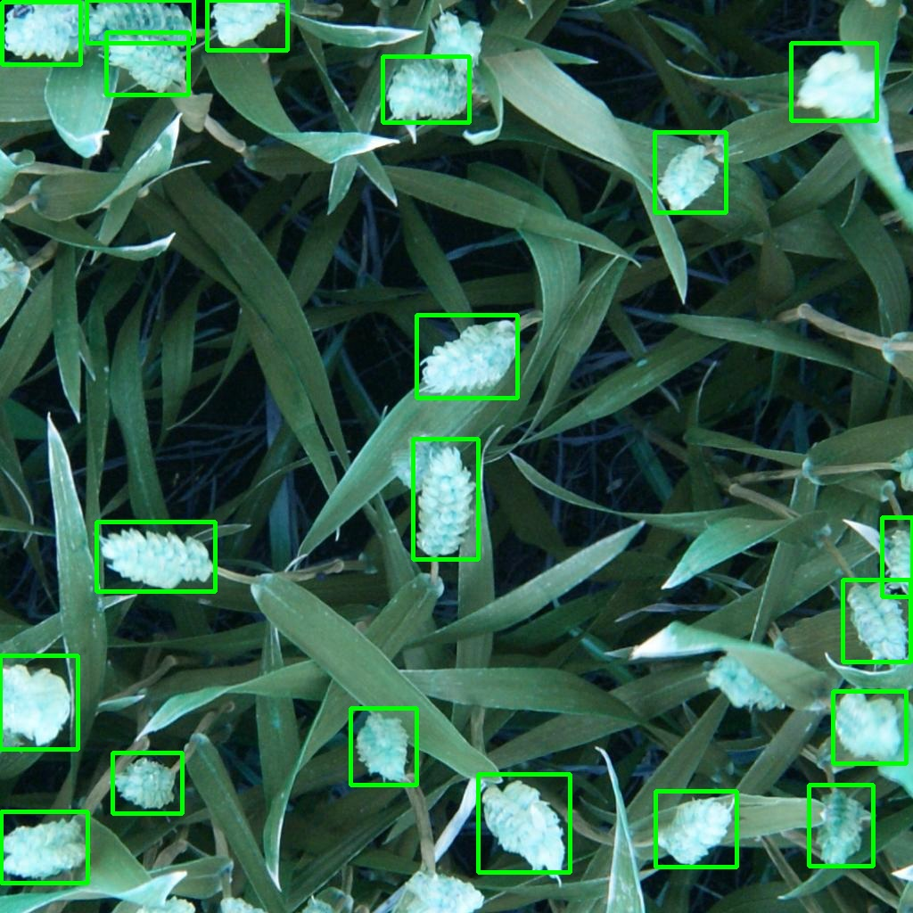

# Wheat-Object-Detection

## Overview:
&emsp;In this project I will use global wheat dataset from past Kaggle competition to detect wheat objects in images. A novel model will be implemented and adjusted using Pytorch Transfer Learning. The automated process of detecting wheat in images helps in efficient crop decisions and help in reducing resources. A state of the art machine learning model can replace manual crop detection by workers, saving valuable time and effort.
    
&emsp;The Global Wheat Head Dataset is led by nine research institutes from seven countries: the University of Tokyo, Institut national de recherche pour l’agriculture, l’alimentation et l’environnement, Arvalis, ETHZ, University of Saskatchewan, University of Queensland, Nanjing Agricultural University, and Rothamsted Research. The training set includes 3422 images. The test set contains only 10 images. For the purposes of this project, I will only use a subset of images from the training set. 1105 images were randomly chosen from the original dataset for training(90%, 994 images) and validation (10%, 111 images). Each image contains at least one wheat head, and is in .jpg format. The training/validation datasets will be loaded in batches using PyTorch DataLoader method.
  
&emsp;Wheat is a staple across the globe, which is why this competition must account for different growing conditions. Models developed for wheat phenotyping need to be able to generalize between environments. If successful, researchers can accurately estimate the density and size of wheat heads in different varieties. With improved detection farmers can better assess their crops, ultimately bringing cereal, toast, and other favorite dishes to your table.

Dataset can be dowloaded from here:
- LINK: https://www.kaggle.com/c/global-wheat-detection/data
- API: kaggle competitions download -c global-wheat-detection
 
 
  
 Training and Deployment made using SageMaker. Please read Files section below for more information.
 
 ## Goal
 
 Detecting wheat heads in images and evaluating the performance of the model. 
 
 

## Requirements to run Notebook:
torch==1.4.0  
torchvision==0.5.0  
numpy==1.19.5  
pandas==1.1.5  
Pillow==8.1.0  
sagemaker==2.41.0  
opencv-python==4.5.1

## Files:
Wheat-Object-Detection/ 
├── README.md 
├── front 
│   └── my_front.html 
├── img_with_boxes.jpg 
├── model.ipynb 
├── requirements.txt 
├── source 
│   ├── predict.py 
│   └── train.py 
└── train.csv   

train.csv - contains image_id, width and height of image (1024x1024),  
&emsp;&emsp;&emsp;&emsp;boundary boxes for all images,format: **[x, y, box-width, box-height]**, and source of image.  
source/ contains all necessary files to train and deploy using SageMaker  
front/ contains the front end - an html file to upload an image   
img_with_boxes.jpg - an example of prediction that was saved  
See model.ipynb for complete workflow of the project.  

## Training / Evaluation 

USing Fast R-CNN-ResNet50-FPN pretrained PyTorch model on 994 images from original training set, and 111 images for validation. 

## Predictions

Predictions are made on test images in test folder. Please refer to Kaggle competition website to view and download the images, or use Kaggle API:
- LINK: https://www.kaggle.com/c/global-wheat-detection/data
- kaggle competitions download -c global-wheat-detection

Example of prediction - image was taken from test folder:

